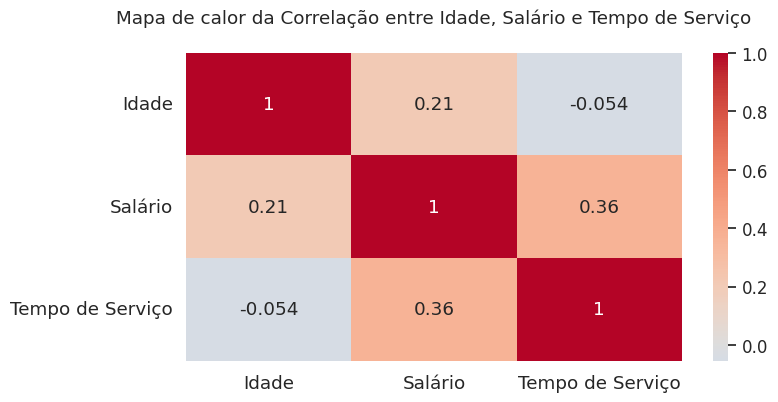

# Mapa de Calor e Matriz de Correlação

Existe uma série de vizualizações que podemos utilizar para relacionar dados, sendo duas delas batante comuns para uma pessoa cientita de dados: os **mapa de calor** *(heatmap)* e as **matrizes de correlação**. Elas ajudam a identificar relações entre variáveis, bem como investigar a força entre as relações que podemos chamar de correlação dos dados. Mas o que é cada um deles?

## Mapa de calor

O mapa de calor é um representação gráfica que mostra a distribuição, relação ou variação dos dados em uma matriz ou espaço bidimensional, utilizando as cores para destacar valores ou como representação de intensidade na distribuição dos dados. Existem vários tipos de mapas de calor, partindo dos mapas de calor de correlação, que vamos dar maior destaque aqui, aos mapas de calor de densidade, os geográficos, entre outros.

O mapa de calor que pode ser utilizado para uma variedade de situalções, incluindo:

- Visualizar a relação entre duas ou mais variáveis (**mapa de calor de correlação**).

- Visualizar a distrubuição de dados (**mapa de calor de intensidade**).

- Apresentar a densidade de ocorrência de um evento em uma área específica (**mapa de calor de densidade**).

- Distribuição geográfica dos dados (**mapa de calor geográfico).

Para representar o relacionamento entre variáveis, o mapa de calor utiliza cores para destacar padrões e variações nos dados no formato de tabela, mostrando a correlação entre diferentes combinações de valores. Os eixos x e y representam as dimensões e a intensidade das cores ou tons representam os valores das células.

## Matriz de correlação

A matriz de correlação é uma tabela que mostra a relação estatística entre múltiplas variáveis. Ela exibe os coeficientes de correlação entre os pares de variáveis, indicando a força e direção da relação linear entre elas. Os valores variam entre -1 e 1, nos quais:

- -1 indica uma correlação negativa perfeita;

- 1 indica uma correlação possitiva perfeita; e

- 0 indica ausência de correlação.

a matriz de correlação pode ser utilizada para uma variedade de situações, incluindo:

- Identificar variáveis que estão relacionadas.

- Eliminar variáveis que não estão relacionadas.

- Auxiliar na escolha de variáveis para modelos de aprendizado de máquina.

### Exemplificando os visuais

Podemos notar que os mapas de calor e as matrizes de correlação podem ser utilizados juntos para uma análise mais completa dos dados. Os mapas são apontados para vizualizar a relação dos dados, enquanto as matrizes de correlação podem ser utilizadas para medir a associação entre variáveis.

Vammos criar um simples exemplo para observar essas visualizações. Temos abaixo uma pequena tabela representando uma lista de 10 funcionários e suas respectivas idades, salários e tempo de serviço em uma dada empresa:


|    |Idade|Salário|Tempo de Serviço|
|:--:|:--:|:---:|:--:|
| 0  | 50 |	3130|  1 |
| 1  | 36 |	4685| 12 |
| 2  | 29 |	3769| 10 |
| 3  | 42 |	5391|  6 |
| 4  | 40 |	8611| 13 |
| 5  | 44 |	9949| 12 |
| 6  | 32 |	5433|  9 |
| 7  | 32 |	8311|  1 |
| 8  | 45 |	8051| 11 |
| 9  | 45 |	9420| 11 |

Para construir a matriz de correlação, vamos passar os dados do DataFrame que gerou a tabela e chamar o método ```corr()``` da biblioteca Pandas que cria essa vizualização:

```
import pandas as pd

df = pd.DataFrame({"Idade": [50, 36, 29, 42, 40, 44, 32, 32, 45, 45],
                   "Salário": [3130, 4685, 3769, 5391, 8611, 9949, 5433, 8311, 8051, 9420],
                   "Tempo de Serviço": [1, 12, 10, 6, 13, 12, 9, 1, 11, 11]})

matriz_correlacao = data.corr()
matriz_correlacao
```

Saída:


|       | Idade|	Salário|	Tempo de Serviço|
| :--:  | :---: | :----: | :---: |
|Idade	|1.000000|	0.210951|	-0.054001|
|Salário|	0.210951|	1.000000|	0.364877|
|Tempo de Serviço|	-0.054001|	0.364877|	1.000000|

A matriz de correlação demonstra a relação entre variáveis. Podemos notas, por exemplo, uma pequena correlação positiva entre o salário e o tempo de serviço. POr fim, vamos representar os dados em um mapa de calor, escrevendo o seguinte código:

```
import seaborn as sns
import matplotlib.pyplot as plt

# Criando o heatmap
fig, ax = plt.subplots(figsize=(8, 4))
sns.set(font_scale=1.1)
sns.heatmap(matriz_correlacao, annot=True, cmap='coolwarm', center=0)
plt.title('Mapa de calor da Correlação entre Idade, Salário e Tempo de Serviço\n')
plt.show()
```

Saída:



Note que utilizamos o método ```heatmap()``` do Seaborn para construir o mapa de calor. As Células são coloridas de acordo com o valor da correlação, facilitando a identificação de padrões e relações entre as variáveis.

Para aprender mais sobre a construção das matrizes de correlação e mapas de calor em Python, indicamos a leitura do método ```corr()``` do Pandas e do método ```heatmap()``` do Seaborn em cada documentação.

Fonte: **Alura**