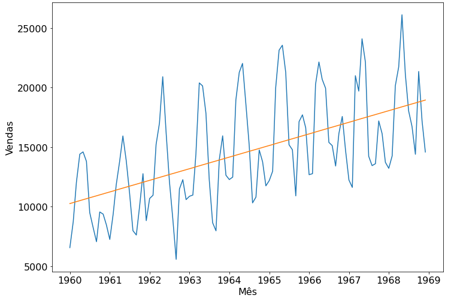
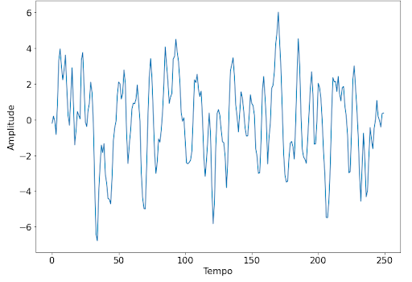

# Modelos matemáticos utilizados em séries temporais

Em problemas de previsão em séries temporais, comumente, ajustamos curvas aos dados observados. O intuito disso é que ao ajustar essa curva obtemos os coeficientes da equação da curva. **tornando possível o cálculo de valores** que estão fora do intervalo dos dados observados.

Aqui, nós temos um exemplo de série temporal onde foi ajustada uma reta. Para ajustar essa reta, tivemos que estimar os coeficientes **a** e **b** da equação da reta.

A equação da reta pode ser escrita de forma genérica como:

(1)

Em nosso exemplo, queremos **calcular o número de carros vendidos** em um determinado mês. Ajustando uma reta à esses dados temos a possibilidade de inserir o valor do mês na equação e obter **o número de carros vendidos como resultado**. Neste caso, a equação da reta toma esta forma:
(2)

Conhecendo esses coeficientes, podemos calcular qualquer ponto da reta, até os de 1970 em diante. É nesse ponto em que estamos fazendo uma previsão. Mas qual equação temos que ajustar no caso desta figura ?

### Modelos autoregressivos e de média móvel

A escolha de uma equação que ajusta uma série temporam sem o conhecimento prévio do problema é extremamente difícil. Neste caso, podemos pensar que queremos estimar o próximo ponto na série temporam e que existe uma dependência linear no tempo entre as amostrar. Desta forma, podemos estimar o ponto seguinte **y_t** através do conhecimento de um ponto anterior **y_{t-1}**.

(3)

A **equação 3** é um exemplo de modelo autorregressivo. Nela, o **c** é uma constante e **phi_1** é o coeficiente que devemos determinar para estabelecer uma relação entre o **y_t** e o **y_{t-1}**. Porém, a estimativa de **y_t** pode depender de mais pontos da série temporal.

Imagem que a cada x segundos você observa um evento com uma forma característica, um evento sazonal, por exemplo. Neste caso, precisamos de uma versão generalizada da equação 3 que considere **p** pontos anteriores da série temporal. A equação a seguir cumpre este papel. (4)

na **equação 4** o épsilon representa o ruído aleatório que pode estar presente nos nossos dados. A equação 4 recebe o nome de modelo autoregressivo.

Mas existem outros tipos de modelos que podem ser ajustados a uma série temporal. Outro exemplo de modelo é o de média móvel. Este tipo de modelo é escrito na seguinte forma:
.(5)

Repare que na **equação 5** os termos **theta_q** são os coeficientes que queremos encontrar e os termos épsilon representam as amostras de ruído aleatório. Ou seja, estamos procurando os coeficientes que fazem com que o ruído aleatório adquira as características dos nossos dados.

Da combinação dos modelos autorregressivos e de média móvel, **temos modelos ARMA**. A determinação da ordem p e q desses modelos pode ser feita através da análise das funções de autocorrelação e autocorrelação parcial. Uma alternativa é a utilização de algoritmos que realizam uma busca, ajustando modelos de ordens diferentes na série temporal, como a função AutoArima da biblioteca [pmdarima](https://alkaline-ml.com/pmdarima/1.8.0/modules/generated/pmdarima.arima.AutoARIMA.html#pmdarima.arima.AutoARIMA).

### Estacionariedade

Os modelos ARMA precisam que a série temporal seja estacionária para serem aplicados. Ou seja, eles precisam que a série temporal não possua tendência ou sazonalidade. Quando a série não é estacionária, aplicamos **modelos ARIMA**. O 'I' do ARIMA está ligado a um processo que permite transformar uma série temporal não estacionária em uma série estacionaria. Terminando esse processo, é adotado um modelo ARMA para previsão..

Fonte: [ALURA](https://www.alura.com.br/artigos/modelos-matematicos-utilizados-em-series-temporais)