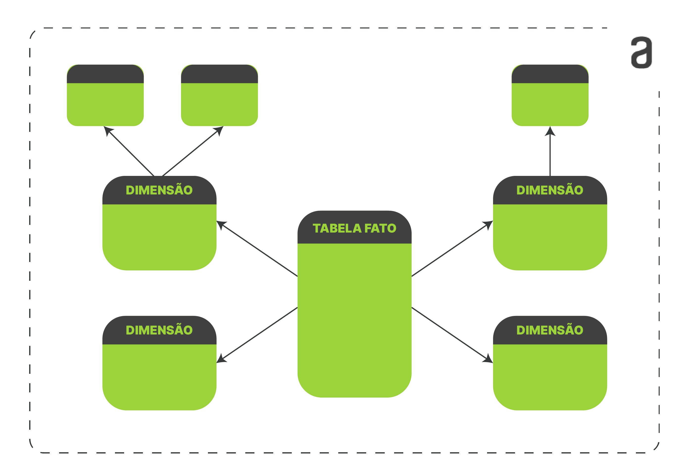
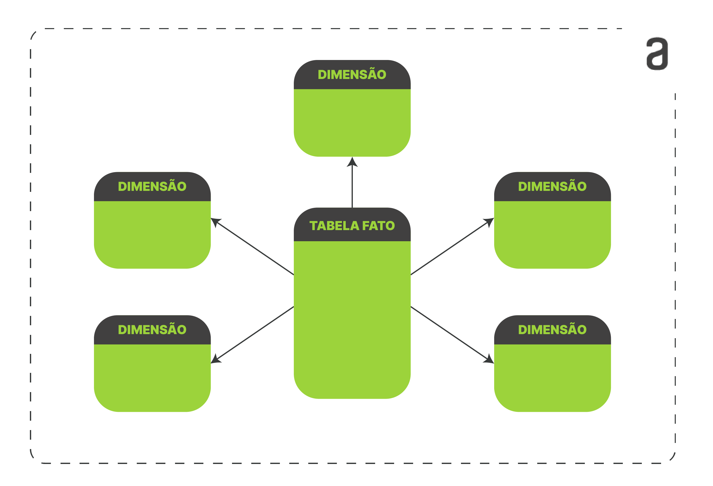

# Para saber mais: explorando a modelagem dimensional

## O que é um Modelo Dimensional?
Um modelo dimensional é basicamente uma **tabela de fatos central e tabelas dimensionais** ligasdas diretamente a ela. Existem dois tipos de modelagem de dados usadas no Power BI, o **Snowflake (floco de neve)** e o **Star Schema (Esquema estrela)**, esse último sendo o mais utilizado.

### **Snowflake (Floco de Neve)**

Nesse modelo, as tabelas dimensionais se relacionam com a tabela fato, porém algumas dimensões se relacionam apenas entre elas. Isso acontece para normalizar  tabelas dimensionais. No modelo snowflake existem tabelas de dimensões auxiliares que normalizam as tabelas de dimensões principais.

#### Vantagens:

- A normalização das dimensões resulta em economia de armazenamento.

- No modelo Snowflake, a hierarquia é representada em um relacionamento de chave externa e chave primária entre as várias tabelas de dimensões. No modelo Star, todas as tabelas de dimensões necessárias têm apenas chaves estrangeiras nas tabelas de fato.

### Star Schema (Esquema estrela)

Nesse modelo, todas as tabelas dimensionais se relacionam diretamente com a tabela fato. As tabelas dimensionais ficam maiores por repetirem as descrições de forma textoual em todos os registros. Esse modelo é chamado de Star porque a tabela de fatos fica no centro cercada das tabelas dimensionais, parecido com uma estrela.

#### Vantagens:

- É mais simples e mais fácil de navegação, mas disperdiça espaço repetindo as mesmas descrições ao longo de toda a tabela.

- Consultas mais simples: a lógica de junção do Star Schema é mais simples que a lógica de junção necessária para recuperar dados de um esquema transacional normalizado.

Fonte: **ALURA**