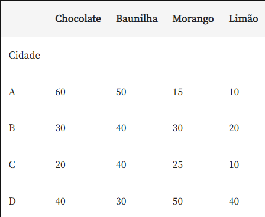
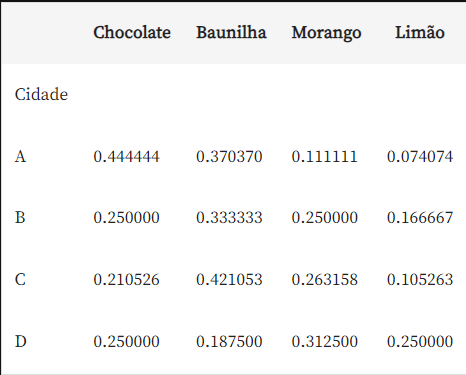

# Normalização dos dados

A normalização de dados tenta resolver o problema da criação de visuais cujos dados possam representar diferenças muito grandes em uma mesma variável tornando difícil a interpretação em nosso gráfico. Além disso, ela é bastante útil quando queremos averiguar a composição dos dados em termos percentuais.

A normalização de dados é essencial para garantir que as variáveis estejam em uma escala comparável, facilitando a interpretação dos resultados. Utilizamos uma expressão similar a ```df = df.div(df.sum(axis=1), axis=0)``` para dividir cada valor pelo somatório da linha correspondente, realizando a normalização das linhas do DataFrame. Isso permite que a pessoa cientista de dados transforme seus dads em uma escala de 0 a 1, que pode ser facilmente transformada em uma escala percentual (0 a 100).

## Por que tranformar em escala percentual?

A transformação dos dados para a escala percentual pode ser extremamente útil para entender seus dados. Por exemplo, se você estivesse analisando vendas de vários produtos, ter a informação em termos percentuais poderia te dizer rapidamente que produto estava gerando a maior parte das vendas.

Transformar seus dados em escala percentual támbem pode ser importante para a normalização. Você pode ter dados onde a maioria das observações esteja em um pequeno intervalo de valores, mas alguns poucos dados muito grandes ou muito pequenos distorcem a escala de tal forma que a maioria deles é espremida em uma pequena parte da escala. Ao normalizar, você garante que todos os dados são representados de forma equitativa.

## Explicando a fórmula de normalização

Vamos utilizar a seguinte fórmula em python:

```
df = df.div(df.sum(axis=1), axis=0)
```

O método **sum()** é aplicado ao longo das linhas (**axis=1**) para calcular a soma de cada linha do DataFrame, atuando como o nosso enominador da divisão. Enquanto que o método **div()** é utilizado para dividir cada valor do DataFrame pelo valor correspondente na soma da sua respectiva linha utilizando o eixo das colunas (**axis=0**).

    É importante ter atenção na divisão que é feita por eixo das colunas porque os valores estão sendo “varridos” na mesma linha pulando coluna a coluna. Por isso que na função div(), passamos o parâmetro axis=0.

Vamos representar em um conjunto de dados normalizados a composição das vendas dos sorvetes da Serenatto - Café & Bistrô de acordo com as 4 principais filiais. Primeiro vamos criar o DataFrame e depois aplicar a normalização com a fórmula explicada mais acima:

```
import pandas as pd

df = pd.DataFrame({'Cidade': ["A", "B", "C", "D"],
                   'Chocolate':[60, 30, 20, 40],
                   'Baunilha': [50, 40, 40, 30],
                   'Morango': [15, 30, 25, 50],
                   'Limão': [10, 20, 10, 40]})

df = df.set_index("Cidade")
df_normalizado = df.div(df.sum(axis=1), axis=0)

```

Vamos ler agora o **df** e o **df_normalizado** para compará-los, sendo o primeiro o conjunto de dados antes da normalização e o segundo já normalizado:

#### Antes da normalização 



#### Após a normalização



Note que os dados foram trazidos entre os valores de 0 a 1 e o omatório de cada linha resulta no valor 1, ou seja1 trazemos todos os dados para uma mensa escala. Podemos então, facilmente transformar essa escala em porcentagem multiplicando todos os valores por 100.

**Observação:** Vamos voltar a explorar este exemplo na próxima atividade construindo o gráfico com esses dados.

Fonte: Alura