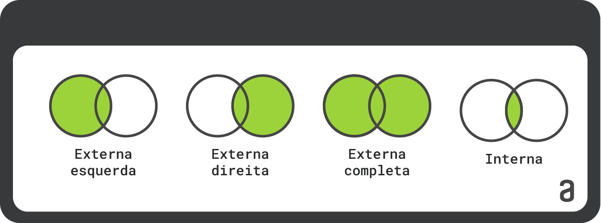

# Tipos de JOIN

Podemos listar quatro tipos de junções: ```LEFT JOIN```, ```RIGHT JOIN```, ```FULL JOIN``` E ```INNER JOIN```. Abaixo uma imagem com quatro Diagramas de Venn, onde cada círculo (cojunto) representa uma tabela do nosso modelo relacional. Vamos conferir as diferenças entre essas principais junções:



### **LEFT JOIN**

O ```LEFT JOIN``` retorna todos os registros da tabela à esquerda na cláusula JOIN. Seu preenchimento tem a característica do diagrama de **Extrema esquerda**. Se não houver correspondência na tabela da direita, os valores NULL serão retornados para as colunas da tabela da direita.

A estrutura a seguir pode ser utilizada para o ```LEFT JOIN```:

```
SELECT <CAMPOS>
FROM TABELA_A
LEFT JOIN TABELA_B
ON TABELA_A.CAMPO = TABELA_B.CAMPO
```

### **RIGHT JOIN**

O ```RIGHT JOIN``` é o oporto do LEFT JOIN. Ele retorna todos os registros da tabela da direita e os registros correspondentes da tabela da esquerda. Seu preenchimento tem a característica do diagrama de **Externa direita**. Se não houver correspondência na tabela da esquerda, os valores NULL serão retornados para as colunas da tabela da esquerda.

A estrutura a seguir pode ser utilizada para o ````RIGHT JOIN```:

```
SELECT <CAMPOS>
FROM TABELA_A
RIGHT JOIN TABELA_B
ON TABELA_A.CAMPO = TABELA_B.CAMPO
```

### **FULL JOIN**

O ```FULL JOIN```, também conhecido como ```FULL OUTER JOIN```, retorna todos os registros de ambas as tabelas envolvidas na junção, independentemente da correspondência. Seu preenchimento tem a característica do diagrama de **Externa completa**. Se houver correnpondência, os valores correspondentes serão retornados; caso contrário, os valores NULL serão retornados nas colunas correspondentes.

A estrutura a seguir pode ser utilizada para o ```FULL JOIN```:

```
SELECT <CAMPOS>
FROM TABELA_A
FULL JOIN TABELA_B
ON TABELA_A.CAMPO = TABELA_B.CAMPO
```
### **INNER JOIN**

O ```INNER JOIN``` retorna apenas os registros que têm correspondência em ambas as tabelas envolvidas na junção. Isso significa que apenas onde as chaves correspondentes existem em ambas as tabelas serão incluídas no resultado. Seu preenchimento tem a característica do diagrama de **Interna**.

Para trazer essa interseção das informações entre tabelas, podemos usar no comando:

```
SELECT <CAMPOS>
FROM TABELA_A
INNER JOIN TABELA_B
ON TABELA_A.CAMPO = TABELA_B.CAMPO
```

Para se aprofundar mais nesses e em outros tipos de junção com JOIN, este artigo é mais completo: [Artigo JOIN completo ALURA](https://www.alura.com.br/artigos/join-e-seus-tipos#:~:text=Existem%20cinco%20tipos%20de%20JOIN,FULL%20JOIN%20e%20CROSS%20JOIN)

**Fonte: ALURA**